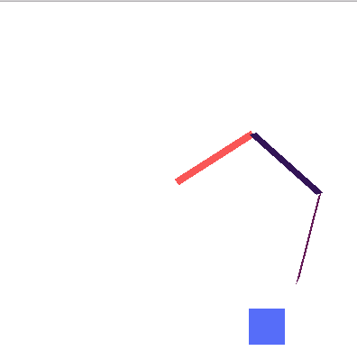

# Catch_me_sim

A custom written script for a 2D simulation of a 3 Degree of freedom robotic arm which automatically reconfigures it's kinematics using reinforcement learning to chase a blue box, which is moved around by a mouse.



# Inspiration
 
 Inspired from a project which was training a 2 DOF robotic arm from scratch. My modification was to convert the kinematics and specifications of the design in the environment(environment.py) so that , the environment would contain a 3 Degree of Freedom arm, and train it to chase the Blue Box.
 
[Refer this link](https://github.com/MorvanZhou/train-robot-arm-from-scratch)

# Running the whole thing

```
git clone https://github.com/abhijithneilabraham/Catch_me_sim/
```

```
cd chaser
```

run 

```
pip install -r requirements.txt
```
and then run

```
python main.py
```


When an input is asked, input "train" for training the environment,(also consider changing the parameters like MAX_EPISODES and MAX_STEPS to see what the outcome is.) else for seeing the Simulation in action, enter "test" .


